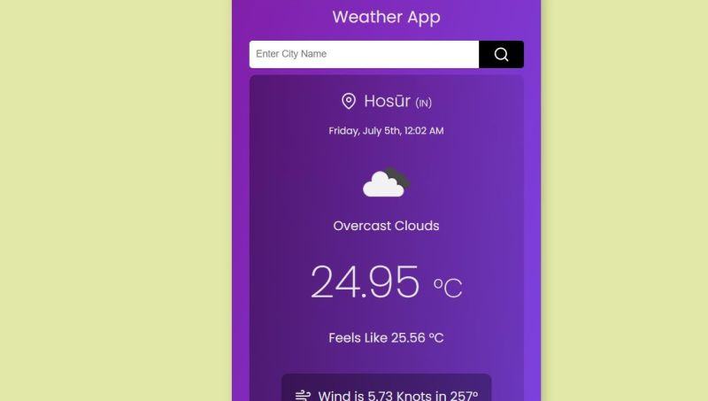

<b><h1>Weather React App☀️</h1> </b>

Description  
The Weather React App is a simple and intuitive web application built with React that allows users to fetch and display real-time weather information by entering a city name. The app uses an external weather API to retrieve data and presents it in a user-friendly format.
  
  
<b>Features</b>
  
<b>🌧️Real-time Weather Data:</b> Fetches up-to-date weather information based on the entered city name. 
  
<b>🔥Temperature:</b> Displays the current temperature in Celsius. 
  
<b>🌦️Humidity:</b> Shows the current humidity level as a percentage. 
  
<b>❄️Wind Speed:</b> Provides the current wind speed in kilometers per hour (km/h). 
  
<b>User-Friendly Interface:</b> Simple and clean design for an optimal user experience. 
  
</img> 
<b>How to Use</b> 
  
<b>🏙️Enter City Name:</b> Type the name of the city you want to get the weather information for in the input field. 
  
<b>Submit:</b> Press the "Get Weather" button to fetch the weather data. 
  
<b>View Results:</b> The weather information, including temperature, humidity, and wind speed, will be displayed on the screen. 
  
<b>Technologies Used</b> 
  
<b>React:®️</b> Front-end library for building user interfaces. 
  
<b>Weather API:</b> External API service to fetch real-time weather data. 
